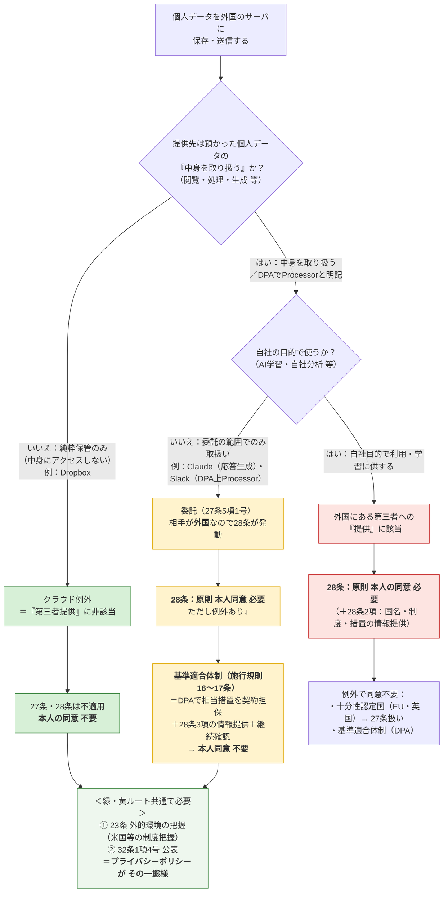

# 個人情報と弊所の体制

> 個人データを海外サーバに保存・送信する場合の判断フロー（個人情報保護法）
> 対象サービス：**Slack（Business+）** / **Claude（Team）** / **Bedrock（AWS）** / **Dropbox**
> 現状（2026-07）：全所員が Claude Team 利用／Slack は Business+ へ移行予定（東京）／Bedrock は玉井のみ・ほぼ未使用／Slack↔Claude連携は検討中

---

## 判断フロー（1枚図）

> [!tip] 3つの出口の違い
> - **クラウド例外（緑・Dropbox）**：純粋保管で中身を取り扱わない → 28条そのものが不適用。同意不要。
> - **委託＋基準適合体制（黄・Claude・Slack）**：中身は取り扱う（またはDPAでProcessorと明記）が自社目的では使わない → 28条は発動するが、DPAで担保して同意不要。**保守的にこちらへ寄せる。**
> - **提供（赤）**：相手が自社目的で使う → 本来の28条。原則同意が必要（個人アカウントの学習オプトイン等でここに落ちる）。

---

## 弊所の整理（当てはめ）

> [!info] 弊所の整理：2ルートに分かれる（保守側に寄せる）
> **純粋保管（Dropbox）＝クラウド例外（緑）**、**Slack・Claude＝委託＋基準適合体制（黄）**。いずれも結論は**本人同意 不要**。Slack・Claudeは28条が発動するため、**DPAによる基準適合体制＋28条3項の情報提供・継続確認**が追加で必要。共通して**23条（外的環境の把握）＋32条（公表）**の対応が要る。
> ※Slackは純粋保管とも読めるが、**DPA上Slack自身をProcessorと位置づけている**ため、クラウド例外一本ではなく**委託に寄せる保守的整理**を採る。

| サービス | 主な用途 | 取扱い | 法的整理 | 28条 | 本人同意 | 主な保管国 |
|---|---|---|---|---|---|---|
| **Slack（Business+）** | 所内コミュニケーション | DPA上Processor（指示に基づき処理） | **委託（保守的整理）** | **適用** | **不要（基準適合体制で）** | **日本（東京）**※認証は米国経由・一部メタは米国 |
| **Claude（Team）** | 業務補助AI | 応答生成のため取り扱う（学習しない） | **委託** | **適用** | **不要（基準適合体制で）** | 米国 |
| **Bedrock（玉井・ほぼ未使用）** | 業務補助AI（将来） | 応答生成（AWS内・学習なし） | 委託（AWS DPA） | 適用 | 不要（基準適合体制で） | **東京選択可** |
| **Dropbox** | ファイル保管・共有 | 純粋保管（中身にアクセスしない） | **クラウド例外（弊所はそう整理）** | 不適用 | 不要 | 米国等（プラン・設定により要確認） |

> [!important] Dropbox について（クラウド例外を維持）
> **弊所は Dropbox をクラウド例外として整理する。** Dropbox は預かったファイルを自社の目的で取り扱わない**純粋保管サービス**であり、「第三者提供」に非該当と考える。Slack・Claude を委託に寄せた後も、Dropbox は純粋保管であることを理由にクラウド例外を維持する（両者は defensible）。

> [!warning] Slack について（保守的に委託へ）
> Slack は「純粋保管＝クラウド例外」とも読めるが、**Slack DPA が Slack 自身を Customer の指示に基づき処理する Processor と位置づけている**ため、**委託＋基準適合体制**に寄せて整理する（後日の再評価リスクに備える保守側の選択）。Business+ 化で**保管は東京リージョン**になるが、**認証（ログイン）は米国経由**が残る点に留意。
> **Slack AI（Business+ で利用可）**：顧客データを**LLM学習に使わない**／モデルは**Slack自身のAWS VPC内**でホストされ提供者はアクセス不可／推論後**非保持**（RAG方式）／**既存のアクセス権限を尊重**。→ **APPI上の新カテゴリは生じない**（委託の枠内）。ただし**Slack AI推論の実行リージョン（東京内か）はSlackに要確認**。秘匿案件は**権限限定のプライベートチャンネル**に隔離する。

> [!warning] Claude について（クラウド例外ではなく委託）
> Claude は入力プロンプトの**中身を読んで応答を生成する**ため、「取り扱わない」を条件とするクラウド例外には馴染まない。**委託**と整理し、相手が外国（米国）にあるため**28条が発動**する。もっとも、**Anthropic の商用規約に組み込まれた標準DPA**（Team契約に自動適用。小規模事務所でも同一内容で利用可）により**基準適合体制**を満たせるので、**個別の本人同意は不要**。
> やること：① 標準DPAの適用を確認・保管、② 本人の求めに応じ移転先措置を説明できる状態、③ サブプロセッサ・規約変更の年1回確認。

> [!note] 32条の公表について（明記）
> 32条1項4号は「保有個人データの安全管理のために講じた措置」を**本人が知り得る状態に置く**ことを求める。**この公表の一態様が、プライバシーポリシー（個人情報保護方針）への記載**である。弊所は外的環境の把握（米国等）の内容をプライバシーポリシーに記載してこの義務を履行する。

---

## 参照条文

| 条文 | 内容 | 弊所での位置づけ |
|---|---|---|
| **27条** | 第三者提供の制限（国内） | クラウド例外なら非該当。委託は5項1号で非該当 |
| **28条**（旧24条） | 外国にある第三者への提供の制限 | Dropbox（純粋保管）は不適用。**Slack・Claude（委託・米国）は適用→基準適合体制で対応** |
| **27条5項1号** | 委託は「第三者」に非該当 | Slack・Claudeは委託。ただし国内限定の効果で、外国だと28条が別途かかる |
| **施行規則16〜17条** | 基準適合体制（相当措置の継続的確保） | **DPAで担保**＋28条3項の情報提供＋継続確認 |
| **17条2項** | 要配慮個人情報の**取得に原則本人同意** | 越境（28条）とは別軸。一般事件でも要配慮が紛れたら要注意（→情報トリアージ） |
| **番号法**（マイナンバー法） | 特定個人情報の厳格規律 | APPIと別法。**Slack/Claude/Bedrockに入れない** |
| **23条** | 安全管理措置（→**外的環境の把握**） | 米国等の制度を把握し措置を実施（全サービス共通） |
| **32条1項4号** | 保有個人データに関する公表等 | **プライバシーポリシーで公表**（一態様） |

> 根拠：個人情報保護委員会「個人情報の保護に関する法律についてのガイドライン（通則編／外国にある第三者への提供編）」及び同Q&A（クラウドサービスに関するいわゆる「クラウド例外」／委託先が外国にある場合の28条適用／基準適合体制）。生成AIへの入力については同委員会「生成AIサービスの利用に関する注意喚起」も参照。

> [!note] DPA/SCC と データレジデンシーは別レイヤー（重複ではない）
> - **DPA／SCC（基準適合体制）＝契約レイヤー**：「越境**してよいか**（適法性の根拠）」を解決する。金庫の**移動許可証**であって、金庫そのものは動かさない。
> - **データレジデンシー＝物理レイヤー**：「データが**どこに在るか**」を変える設定。
> - なぜ両方要るか：**Schrems II（CJEU 2020）**が「**SCCだけでは相手国の監視法（米FISA702・CLOUD Act）に対して不十分**」と判断し、**補完的措置（supplementary measures）**を要求した。**リージョン内保管はその代表的な補完措置**で、契約では代替できない。加えて**データローカライゼーション法**（国内物理保管を義務付ける国・分野）は物理でしか満たせない。
> - **弊所（APPI）**：residencyは**法的義務ではなくリスク低減・信頼のオプション**。Slack がこの機能を出すのは主にGDPR補完措置・ローカライゼーション法・顧客要求のため。

> [!note] Claude（委託）の基準適合体制：条文の根拠
> - **基準適合体制の根拠**：施行規則**16条1号**（提供元・提供先間の契約等により、提供先が相当措置を実施することを確保）。→ Anthropic の商用規約に引用組込みされた**標準DPA**がこれに当たる。
> - **相当措置の継続的確認**：施行規則**18条1項1号**（提供先による相当措置の継続的な実施状況を確認）。→ サブプロセッサ・規約変更の年1回確認。
> - **本人の求めに応じた情報提供**：法**28条3項**・施行規則**18条3項**（移転先国名・制度・講じた措置等を本人に情報提供）。
> - **DPAの組込み根拠**：Anthropic Commercial Terms of Service「Data Privacy」条項に *"...processed in accordance with the Anthropic Data Processing Addendum, which is **incorporated into these Terms by reference**"* と規定。商用規約への同意でDPAに同意したことになる（Team・Enterprise・APIに適用、別途署名不要）。

---

## DPA義務 ⇔ APPI安全管理措置 対応表（項目6の裏付け）

> [!info] なぜ必要か
> 規則16条1号が求めるのは、提供先が「日本の個人情報取扱事業者が講ずべき措置に**相当する**措置」を継続すること。AnthropicのDPAは**GDPRベース**（一般にAPPIと同等以上）だが、「GDPR準拠＝自動的にAPPIを満たす」ではないため、DPAの各義務がAPPIの安全管理措置（組織的・人的・物理的・技術的）に対応することを一度マッピングして記録に残す。

| APPIの安全管理措置（区分） | 対応するDPA/商用規約の定め | 確認欄 |
|---|---|---|
| **基本方針・利用目的の限定** | 顧客をController・AnthropicをProcessorと位置づけ、**顧客の指示およびサービス提供目的の範囲でのみ処理**。顧客データを**学習に使わない／売却・共有しない** | ☐ |
| **組織的安全管理措置** | 処理活動の記録、責任体制、監査協力・情報提供義務 | ☐ |
| **人的安全管理措置** | 従業者の**秘密保持義務**、アクセスする者の限定 | ☐ |
| **物理的安全管理措置** | データセンターの物理セキュリティ（米国DC・アクセス制御） | ☐ |
| **技術的安全管理措置** | **保存時・通信時の暗号化**、アクセス制御、認証 | ☐ |
| **漏えい等への対応** | **セキュリティ侵害時の通知**義務 | ☐ |
| **委託先（再委託）の管理** | **サブプロセッサ管理**（一覧開示・同等義務の課しつけ・変更通知） | ☐ |
| **削除・返却** | 契約終了時のデータ**削除・返却**、保持期間の定め | ☐ |
| **越境移転の担保** | **標準契約条項（SCC）**の引用組込み（GDPR用だが相当措置の裏付け） | ☐ |

- [ ] 上表を確認し、DPA本文の該当箇所を突き合わせて社内記録に保管（更新日管理）

---

## 情報トリアージ（種類別の投入ルール）

> [!info] 方針：一般個人情報はマスキング撤廃／禁止2カテゴリは維持
> 事務作業の煩雑さを避けるため、**一般事件の一般個人情報はマスキングなし**でSlack・Claudeに入れてよい。**体制（DPA・外的環境の把握の公表・利用目的にAI/クラウド利用を含める）が整っていれば、一般個人情報についてAPPI違反にはならない**（＝これはリスクテイクの問題で、APPIは残余リスクに含まれない）。
> **ただし唯一の留保**：「一般事件」の中に**要配慮個人情報・マイナンバー**が紛れ込む点。この2カテゴリだけは"入れない"を維持する。

| 区分 | 例 | 投入可否・経路 | 加工 |
|---|---|---|---|
| **① 禁止（入れない）** | マイナンバー・特定個人情報、本人確認書類（免許/マイナンバーカード/パスポート写し）、**生の要配慮**（病歴・犯罪歴・被害事実） | Slack/Claude/Bedrock いずれも不可 | ― |
| **② 要最小化（推奨マスキング）** | 相手方・第三者の情報、事実上センシティブ（資産・家族関係・所在・通信内容・SOGI 等） | 原則マスキング。重い場合は将来 **Bedrock東京** へ | 記号化（A社・X氏） |
| **③ 通常（マスキング不要）** | 一般事件の依頼者・関係者の氏名・連絡先・通常の案件事実 | **Slack・Claude 可（生でよい）** | 任意 |

> [!warning] 「一般事件」に潜む要配慮の例
> 交通事故の診断書（病歴）、離婚事件のDV・健康・親子関係、刑事・被害者案件（犯罪歴・被害事実）は、一般事件でも**要配慮**が登場する。**事件類型ではなく"情報の中身"で①②を判定**する。

---

## マスキング撤廃で引き受けるリスク（APPI以外）

> [!info] リスクの所在が移るだけ
> 一般個人情報のマスキングを外すと、**APPI（問題なし）から下記へリスクの所在が移る**。リスクが消えるわけではないので、対策とセットで判断する。

| # | リスク | 中身 | 効く対策 |
|---|---|---|---|
| **A** | **弁護士の守秘義務**（最大） | 依頼者の秘密を同意なく米国クラウド/AIに置く・読ませることが守秘義務（弁護士法23条・職務基本規程）に触れないか。**APPIより広く**、法人の秘密・非個人情報も対象。正当なクラウド利用は許容という整理が有力だが**確立した公式見解はなくグレー** | **委任契約/エンゲージメントレターでAI・クラウド利用の包括同意**を取得。相手方・第三者の秘密に注意 |
| **B** | **情報漏えい・セキュリティ** | ベンダー侵害・設定ミス・アカウント乗っ取り。**生データは漏えい被害が大きい**（マスキングは被害を縮小する） | SSO・2FA・権限最小化・保持最小化・アクセス監査 |
| **C** | **米国政府アクセス（CLOUD Act）** | 米国プロバイダは米国当局の開示命令に服し得る。**リージョンでは完全に防げない**。稀だが機微案件でゼロでない | 機微案件は Bedrock東京＋自社鍵、または入れない |
| **D** | **前提崩壊リスク** | 「学習しない・自社目的で使わない」前提が規約変更や**個人アカウント混在**で崩れると、提供・目的外の問題が再燃 | 全員Teamアカウント維持（済）・年1回規約確認 |
| **E** | **説明責任・レピュテーション** | 露見・漏えい時の事後説明責任。信用毀損・損害賠償・懲戒の可能性 | 内規で運用基準を明文化し判断の合理性を記録 |
| **F** | **依頼者との個別契約** | 企業法務等でAIツール/第三者クラウド禁止がNDA・委任契約で課される場合、一般事件でも契約違反 | 受任時に依頼者側のIT・機密要求を確認 |

> [!tip] 一番効く一手
> **A（守秘）への手当て＝依頼者からのAI・クラウド利用の包括同意**（委任契約・重要事項説明に一文）。これでマスキング撤廃の判断が最も守りやすくなる。

---

## 要点（3行まとめ）

1. **Dropbox（純粋保管）はクラウド例外**、**Slack・Claudeは委託＋基準適合体制**（保守側に寄せる） → いずれも**本人同意は不要**。標準DPA（小規模でも同一内容）で基準適合体制を満たす。共通して**23条（外的環境の把握）＋32条（公表）**が必要（公表の一態様＝プライバシーポリシー）。
2. **一般個人情報はマスキング撤廃可**（体制が整えばAPPI違反にならない）。ただし**①マイナンバー・本人確認書類、②生の要配慮（病歴・犯罪歴・被害事実）は"入れない"を維持**。
3. マスキング撤廃で残るのは**APPIでなく、守秘義務・漏えい被害・CLOUD Act・前提崩壊・説明責任・依頼者契約**。**最も効く一手は依頼者からのAI/クラウド利用の包括同意**。
