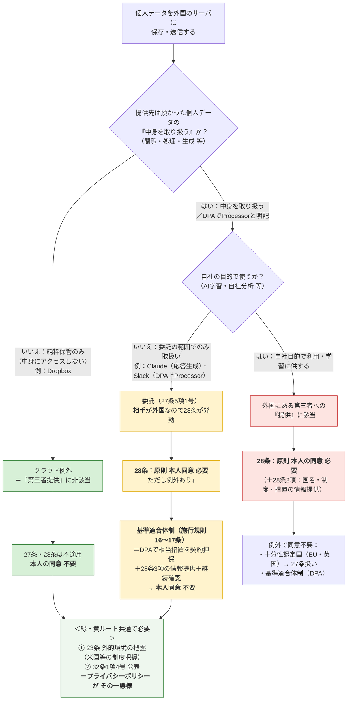

# 個人情報と弊所の体制

> 個人データを海外サーバに保存・送信する場合の判断フロー（個人情報保護法）
> 対象サービス：**Slack（Business+）** / **Claude（Team）** / **Bedrock（AWS）** / **Dropbox**
> 現状（2026-07）：全所員が Claude Team 利用／Slack は Business+ へ移行予定（東京）／Bedrock は玉井のみ・ほぼ未使用／Slack↔Claude連携は検討中

---

## 判断フロー（1枚図）

> [!tip] 3つの出口の違い
> - **クラウド例外（緑・Dropbox）**：純粋保管で中身を取り扱わない → 28条そのものが不適用。同意不要。
> - **委託＋基準適合体制（黄・Claude・Slack）**：中身は取り扱う（またはDPAでProcessorと明記）が自社目的では使わない → 28条は発動するが、DPAで担保して同意不要。**保守的にこちらへ寄せる。**
> - **提供（赤）**：相手が自社目的で使う → 本来の28条。原則同意が必要（個人アカウントの学習オプトイン等でここに落ちる）。

---

## 学説状況：生成AIに「クラウド例外」は及ぶか（なぜ弊所は"委託"に寄せるか）

> [!abstract] 出典：田中浩之「生成AIへの個人情報・営業秘密・機密情報の入力」（前編・Business & Law 2026/4/9）
> 生成AIへの個人情報入力には、**①クラウド例外で「提供」該当性を否定**する構成と、**②委託（27条5項1号）＋外国第三者提供の基準適合体制整備**の2構成がある。共通の前提は、(ｱ)目的外利用をしない、(ｲ)AI事業者が安全管理措置を講じる、(ｳ)入力情報が機械学習に利用されない、の3点。

**クラウド例外は生成AIには馴染みにくい（厳格説が有力）**
- 個情委「Q&A Q7-53」：クラウド例外は、事業者が**「個人データを取り扱わないこととなっている」**（契約で不取扱いを定め、適切にアクセス制御）場合に「提供」該当性を否定するもの。
- **規制改革ホットラインでの個情委回答（令和5年2月16日）**：クラウド事業者が保存データに**「編集・分析等の処理」を行う場合は「取り扱わないこととなっている場合」に該当しない**。→ 生成AIは（一時保存した）データを分析して出力するため、**素直に読めばクラウド例外は使えない**（厳格説）。
- **柔軟説**：生成AI注意喚起（令和5年6月2日）の反対解釈として、「応答結果の出力のみに使い機械学習しないなら『提供』に非該当」とする見解もある。ただし反対解釈には理論的無理との批判があり、**不正監視モニタリング**が入ると「出力目的のみ」の前提も崩れ得る。
- **行政指導の実例**：エムケイシステム事案（個情委 令和6年3月25日）で、個情委は**クラウド例外の適用を否定**（同3月「クラウドサービス提供事業者が…個人情報取扱事業者に該当する場合の留意点（注意喚起）」）。

> [!success] 弊所の結論の裏付け（＝Claude・Slackを"委託"に寄せる理由）
> 前掲・田中弁護士は「**クラウド例外をあえて使う必要がないのであれば、『委託（＋外国第三者提供の基準適合体制整備）』として整理をすれば足りる**」と述べる。第三者提供の同意は委託でも不要になり、クラウド例外の唯一の実益（28条回避）も**基準適合体制で代替できる**からである。**弊所がClaude・Slackを委託に整理するのは、この最も安全な整理に沿ったもの。**

> [!note] 「取扱い」≠「processing」（DPA読解の注意）
> クラウド例外の「取り扱わない」は**日本法独自の概念**で、GDPRの「processing（処理）」より狭い（GDPRでは保管も processing に当たり、クラウド例外の考え方が存在しない）。**Slack・AnthropicのDPAは英語で自らを"Processor"と位置づける**ため、そのままでは「取り扱わない」と読み切れない → **委託整理の方が契約文言に整合的**（この点でもSlack・Claudeを委託に寄せる整理が自然）。

> [!warning] 委託の限界：AI事業者による「学習」の3類型
> 入力データのAI事業者側の学習利用は、①**利用されない**／②**汎用的な自社サービス改善目的**／③**サービス提供に必要な範囲のみ**、に分かれる（経産省「AIの利用・開発に関する契約チェックリスト」令和7年2月・27頁）。**①③は委託の範囲内でOK、②は独自利用として委託の限界を超え得る**。→ **Claude Team・Slackはいずれも「①学習しない」**ため委託整理が成立。**個人アカウントの学習オプトイン等で②に転じると赤ルート（提供）に落ちる**点に注意（＝前提崩壊リスク）。

---

## 令和8年（2026）改正の動向（要監視）

> [!info] 2026/4/7 閣議決定「個人情報保護法等の一部改正法律案」
> - **委託先の義務の見直し（改正30条の3・58条の2）**：委託先が委託元の指示どおり**機械的に処理し自ら取扱方法を決めない**場合、一定の契約管理を条件に4章の一般的義務の適用を原則免除する特例。→ **Slack・Claudeの委託整理をより安定させ得る**（ただし施行後）。
> - **課徴金制度の新設**：違法な取扱いで財産上の利益を得た場合、個情委が課徴金を命令。→ **体制整備を怠るリスクが上昇**（＝本ノートの整備を進める動機）。
> - **統計作成等の特例**：統計結果のみ利用（AI開発等）なら第三者提供に同意不要。
> - **クラウド例外への影響**：クラウド例外は明文規定がないため、**法文改正なしに解釈変更で従来の扱いが変わり得る**（福岡真之介論考が指摘）。改正の帰趨を注視。
> - **施行**：公布から2年以内 → **現時点では未施行**。上記の弊所整理に当面直ちの影響はないと考えられる。

---

## 弊所の整理（当てはめ）

> [!info] 弊所の整理：2ルートに分かれる（保守側に寄せる）
> **純粋保管（Dropbox）＝クラウド例外（緑）**、**Slack・Claude＝委託＋基準適合体制（黄）**。いずれも結論は**本人同意 不要**。Slack・Claudeは28条が発動するため、**DPAによる基準適合体制＋28条3項の情報提供・継続確認**が追加で必要。共通して**23条（外的環境の把握）＋32条（公表）**の対応が要る。
> ※Slackは純粋保管とも読めるが、**DPA上Slack自身をProcessorと位置づけている**ため、クラウド例外一本ではなく**委託に寄せる保守的整理**を採る。

| サービス | 主な用途 | 取扱い | 法的整理 | 28条 | 本人同意 | 主な保管国 |
|---|---|---|---|---|---|---|
| **Slack（Business+）** | 所内コミュニケーション | DPA上Processor（指示に基づき処理） | **委託（保守的整理）** | **適用** | **不要（基準適合体制で）** | **日本（東京）**※認証は米国経由・一部メタは米国 |
| **Claude（Team）** | 業務補助AI | 応答生成のため取り扱う（学習しない） | **委託** | **適用** | **不要（基準適合体制で）** | 米国 |
| **Bedrock（玉井・ほぼ未使用）** | 業務補助AI（将来） | 応答生成（AWS内・学習なし） | 委託（AWS DPA） | 適用 | 不要（基準適合体制で） | **東京選択可** |
| **Dropbox** | ファイル保管・共有 | 純粋保管（中身にアクセスしない） | **クラウド例外（弊所はそう整理）** | 不適用 | 不要 | 米国等（プラン・設定により要確認） |

> [!important] Dropbox について（クラウド例外を維持）
> **弊所は Dropbox をクラウド例外として整理する。** Dropbox は預かったファイルを自社の目的で取り扱わない**純粋保管サービス**であり、「第三者提供」に非該当と考える。Slack・Claude を委託に寄せた後も、Dropbox は純粋保管であることを理由にクラウド例外を維持する（両者は defensible）。

> [!warning] Slack について（保守的に委託へ）
> Slack は「純粋保管＝クラウド例外」とも読めるが、**Slack DPA が Slack 自身を Customer の指示に基づき処理する Processor と位置づけている**ため、**委託＋基準適合体制**に寄せて整理する（後日の再評価リスクに備える保守側の選択）。Business+ 化で**保管は東京リージョン**になるが、**認証（ログイン）は米国経由**が残る点に留意。
> **Slack AI（Business+ で利用可）**：顧客データを**LLM学習に使わない**／モデルは**Slack自身のAWS VPC内**でホストされ提供者はアクセス不可／推論後**非保持**（RAG方式）／**既存のアクセス権限を尊重**。→ **APPI上の新カテゴリは生じない**（委託の枠内）。ただし**Slack AI推論の実行リージョン（東京内か）はSlackに要確認**。秘匿案件は**権限限定のプライベートチャンネル**に隔離する。

> [!warning] Claude について（クラウド例外ではなく委託）
> Claude は入力プロンプトの**中身を読んで応答を生成する**ため、「取り扱わない」を条件とするクラウド例外には馴染まない。**委託**と整理し、相手が外国（米国）にあるため**28条が発動**する。もっとも、**Anthropic の商用規約に組み込まれた標準DPA**（Team契約に自動適用。小規模事務所でも同一内容で利用可）により**基準適合体制**を満たせるので、**個別の本人同意は不要**。
> やること：① 標準DPAの適用を確認・保管、② 本人の求めに応じ移転先措置を説明できる状態、③ サブプロセッサ・規約変更の年1回確認。

> [!note] 32条の公表について（明記）
> 32条1項4号は「保有個人データの安全管理のために講じた措置」を**本人が知り得る状態に置く**ことを求める。**この公表の一態様が、プライバシーポリシー（個人情報保護方針）への記載**である。弊所は外的環境の把握（米国等）の内容をプライバシーポリシーに記載してこの義務を履行する。

---

## 参照条文

| 条文 | 内容 | 弊所での位置づけ |
|---|---|---|
| **27条** | 第三者提供の制限（国内） | クラウド例外なら非該当。委託は5項1号で非該当 |
| **28条**（旧24条） | 外国にある第三者への提供の制限 | Dropbox（純粋保管）は不適用。**Slack・Claude（委託・米国）は適用→基準適合体制で対応** |
| **27条5項1号** | 委託は「第三者」に非該当 | Slack・Claudeは委託。ただし国内限定の効果で、外国だと28条が別途かかる |
| **施行規則16〜17条** | 基準適合体制（相当措置の継続的確保） | **DPAで担保**＋28条3項の情報提供＋継続確認 |
| **17条2項** | 要配慮個人情報の**取得に原則本人同意** | 越境（28条）とは別軸。一般事件でも要配慮が紛れたら要注意（→情報トリアージ） |
| **番号法**（マイナンバー法） | 特定個人情報の厳格規律 | APPIと別法。**Slack/Claude/Bedrockに入れない** |
| **23条** | 安全管理措置（→**外的環境の把握**） | 米国等の制度を把握し措置を実施（全サービス共通） |
| **32条1項4号** | 保有個人データに関する公表等 | **プライバシーポリシーで公表**（一態様） |

> 根拠：個人情報保護委員会「個人情報の保護に関する法律についてのガイドライン（通則編／外国にある第三者への提供編）」及び同Q&A（クラウドサービスに関するいわゆる「クラウド例外」／委託先が外国にある場合の28条適用／基準適合体制）。生成AIへの入力については同委員会「生成AIサービスの利用に関する注意喚起」も参照。

> [!note] DPA/SCC と データレジデンシーは別レイヤー（重複ではない）
> - **DPA／SCC（基準適合体制）＝契約レイヤー**：「越境**してよいか**（適法性の根拠）」を解決する。金庫の**移動許可証**であって、金庫そのものは動かさない。
> - **データレジデンシー＝物理レイヤー**：「データが**どこに在るか**」を変える設定。
> - なぜ両方要るか：**Schrems II（CJEU 2020）**が「**SCCだけでは相手国の監視法（米FISA702・CLOUD Act）に対して不十分**」と判断し、**補完的措置（supplementary measures）**を要求した。**リージョン内保管はその代表的な補完措置**で、契約では代替できない。加えて**データローカライゼーション法**（国内物理保管を義務付ける国・分野）は物理でしか満たせない。
> - **弊所（APPI）**：residencyは**法的義務ではなくリスク低減・信頼のオプション**。Slack がこの機能を出すのは主にGDPR補完措置・ローカライゼーション法・顧客要求のため。

> [!note] Claude（委託）の基準適合体制：条文の根拠
> - **基準適合体制の根拠**：施行規則**16条1号**（提供元・提供先間の契約等により、提供先が相当措置を実施することを確保）。→ Anthropic の商用規約に引用組込みされた**標準DPA**がこれに当たる。
> - **相当措置の継続的確認**：施行規則**18条1項1号**（提供先による相当措置の継続的な実施状況を確認）。→ サブプロセッサ・規約変更の年1回確認。
> - **本人の求めに応じた情報提供**：法**28条3項**・施行規則**18条3項**（移転先国名・制度・講じた措置等を本人に情報提供）。
> - **DPAの組込み根拠**：Anthropic Commercial Terms of Service「Data Privacy」条項に *"...processed in accordance with the Anthropic Data Processing Addendum, which is **incorporated into these Terms by reference**"* と規定。商用規約への同意でDPAに同意したことになる（Team・Enterprise・APIに適用、別途署名不要）。

---

## DPA義務 ⇔ APPI安全管理措置 対応表（項目6の裏付け）

> [!info] なぜ必要か
> 規則16条1号が求めるのは、提供先が「日本の個人情報取扱事業者が講ずべき措置に**相当する**措置」を継続すること。AnthropicのDPAは**GDPRベース**（一般にAPPIと同等以上）だが、「GDPR準拠＝自動的にAPPIを満たす」ではないため、DPAの各義務がAPPIの安全管理措置（組織的・人的・物理的・技術的）に対応することを一度マッピングして記録に残す。

| APPIの安全管理措置（区分） | 対応するDPA/商用規約の定め | 確認欄 |
|---|---|---|
| **基本方針・利用目的の限定** | 顧客をController・AnthropicをProcessorと位置づけ、**顧客の指示およびサービス提供目的の範囲でのみ処理**。顧客データを**学習に使わない／売却・共有しない** | ☐ |
| **組織的安全管理措置** | 処理活動の記録、責任体制、監査協力・情報提供義務 | ☐ |
| **人的安全管理措置** | 従業者の**秘密保持義務**、アクセスする者の限定 | ☐ |
| **物理的安全管理措置** | データセンターの物理セキュリティ（米国DC・アクセス制御） | ☐ |
| **技術的安全管理措置** | **保存時・通信時の暗号化**、アクセス制御、認証 | ☐ |
| **漏えい等への対応** | **セキュリティ侵害時の通知**義務 | ☐ |
| **委託先（再委託）の管理** | **サブプロセッサ管理**（一覧開示・同等義務の課しつけ・変更通知） | ☐ |
| **削除・返却** | 契約終了時のデータ**削除・返却**、保持期間の定め | ☐ |
| **越境移転の担保** | **標準契約条項（SCC）**の引用組込み（GDPR用だが相当措置の裏付け） | ☐ |

- [ ] 上表を確認し、DPA本文の該当箇所を突き合わせて社内記録に保管（更新日管理）

---

## 情報トリアージ（種類別の投入ルール）〔2026-07 改訂〕

> [!info] 方針：一般個人情報はマスキング撤廃／要配慮情報は"全面禁止"から"Bedrock限定"へ緩和
> 事務作業の煩雑さを避けるため、**一般事件の一般個人情報（相手方・第三者情報を含む）はマスキングなし**でSlack・Claudeに入れてよい。**体制（DPA・外的環境の把握の公表・利用目的にAI/クラウド利用を含める）が整っていれば、一般個人情報についてAPPI違反にはならない**（＝これはリスクテイクの問題で、APPIは残余リスクに含まれない）。
> **生の要配慮個人情報（病歴・犯罪歴・被害事実等）は、以前は"入れない"（全面禁止）としていたが、以下のとおり緩和する**：APPI上、要配慮情報の特別ルールは**取得段階の同意（17条2項）**であり、越境（28条）に追加の壁はない。全面禁止は"漏えい時の被害の大きさ"に配慮した上乗せのリスク管理に過ぎなかったため、**より統制の強い経路（Bedrock東京・自社鍵・監査ログ）に限定する**ことで、上乗せの程度を"入れない"から"Bedrock限定"へ緩和する。マイナンバー・本人確認書類は従来どおり全面禁止を維持する（番号法上の別規律のため）。

| 区分 | 例 | 投入可否・経路 | 加工 |
|---|---|---|---|
| **① 全面禁止（Slack/Claude/Bedrockいずれも不可）** | マイナンバー・特定個人情報、本人確認書類（免許/マイナンバーカード/パスポート写し） | いずれも不可 | ― |
| **② Bedrock限定（東京・自社鍵・監査ログ）** | **生の要配慮個人情報全般**＝病歴・診断書等の医療情報、犯罪歴、被害事実（DV・虐待・性犯罪被害等）の**原本・画像・スキャンファイル**そのもの | **Bedrockでのみ**入力・処理可。Slack・Claudeへの入力は不可 | 原本のまま可（Bedrock内） |
| **③ 通常（マスキング不要）** | 一般事件の依頼者・相手方・第三者の氏名・連絡先・通常の案件事実。**準備書面等での傷病名・被害内容への"記述的言及"**（原本添付ではない） | **Slack・Claude 可（生でよい）** | 任意 |

> [!important] ②と③の境界線：「原本・画像」か「記述的言及」か
> - **② に当たる例**：カルテ・診断書・鑑定書・前科調書等の**原本ファイル／画像／スキャンをそのままアップロード・入力**する行為。
> - **③ で足りる例**：準備書面の下書きで「原告は頸椎捻挫の傷害を負った」「被告には〇年の前科がある」といった**事件経過としての記述的言及**。傷病名等に触れるだけで逐一Bedrockに切り替える必要はない。
> - **判断基準は"事件類型"ではなく"入力する物の性質"（原本そのものか、要約・記述か）**。同じ交通事故事件でも、診断書PDFの読み込みは②、準備書面ドラフトの相談は③となる。

> [!warning] 運用開始のタイミング（暫定措置）
> 本ルール（特に②のBedrock限定）は**内規としては本改訂で確定**するが、Bedrockは現状**玉井のみ・ほぼ未使用**であり、全所員が実際に使える状態（アカウント付与・東京リージョン固定・権限設計）には至っていない。
> **Bedrockの全所員展開が完了するまでの間は、②に該当する生の要配慮情報（原本・画像）の入力そのものを暫定的に保留**し、紙・既存の保管方法（Dropbox等）で対応する。展開完了後、本ルールの運用を開始する。

### 社内ルール策定時の検討事項（後編・図表1準拠）

| 検討カテゴリ | 弊所での具体ルール |
|---|---|
| **入力先AIのホワイトリスト化** | 安全性を確認した生成AI（**Claude Team／将来のBedrock**）のみ入力可。それ以外の生成AI（個人アカウント・無償ツール等）への機密・個人情報入力は禁止 |
| **高い必要性の要求** | 入力しなくても同等の目的が達成できるなら入力を避ける（＝「入れなければよかった」を避ける） |
| **個人情報の量的・質的制限** | **要配慮・機微情報の原本・画像はBedrock限定**（記述的言及はSlack/Claude可、上記トリアージ参照）／**不正利用で財産的被害のおそれがある情報**（規則7条2号類型）の禁止／**大量の個人情報**の入力禁止（分割による僭脱も禁止）／必要なければ特定個人を識別できる形での入力を避ける |
| **秘密区分との整合** | 依頼者・相手方から預かった機密のうち**「極秘」相当は入力禁止**。弊所の秘密管理区分に沿って運用 |
| **NDA違反リスクの低減** | AI利用が明示禁止、または**違約金・即時解除・賠償制限適用除外**などNDA違反時のリスクが高い情報は、**AIに入れない別領域で保存** |
| **AIエージェント対策** | 入力禁止情報は、**AIエージェント（Claude Cowork・Slack連携・Copilot等）が自動で拾い得る領域とは別の領域**に保存（→後述） |

---

## マスキング撤廃で引き受けるリスク（APPI以外）

> [!info] リスクの所在が移るだけ
> 一般個人情報のマスキングを外すと、**APPI（問題なし）から下記へリスクの所在が移る**。リスクが消えるわけではないので、対策とセットで判断する。

| # | リスク | 中身 | 効く対策 |
|---|---|---|---|
| **A** | **弁護士の守秘義務**（最大） | 依頼者の秘密を同意なく米国クラウド/AIに置く・読ませることが守秘義務（弁護士法23条・職務基本規程）に触れないか。**APPIより広く**、法人の秘密・非個人情報も対象。正当なクラウド利用は許容という整理が有力だが**確立した公式見解はなくグレー** | **委任契約/エンゲージメントレターでAI・クラウド利用の包括同意**を取得。相手方・第三者の秘密に注意 |
| **B** | **情報漏えい・セキュリティ** | ベンダー侵害・設定ミス・アカウント乗っ取り。**生データは漏えい被害が大きい**（マスキングは被害を縮小する） | SSO・2FA・権限最小化・保持最小化・アクセス監査 |
| **C** | **米国政府アクセス（CLOUD Act）** | 米国プロバイダは米国当局の開示命令に服し得る。**リージョンでは完全に防げない**。稀だが機微案件でゼロでない | 機微案件は Bedrock東京＋自社鍵、または入れない |
| **D** | **前提崩壊リスク** | 「学習しない・自社目的で使わない」前提が規約変更や**個人アカウント混在**で崩れると、提供・目的外の問題が再燃 | 全員Teamアカウント維持（済）・年1回規約確認 |
| **E** | **説明責任・レピュテーション** | 露見・漏えい時の事後説明責任。信用毀損・損害賠償・懲戒の可能性 | 内規で運用基準を明文化し判断の合理性を記録 |
| **F** | **依頼者・第三者との個別契約（NDA）** | 企業法務等でAIツール/第三者クラウド禁止がNDA・委任契約で課される場合、一般事件でも契約違反。相手方・第三者から預かった秘密は**第三者開示禁止・目的外利用禁止・返還削除義務**に触れ得る（→次章） | 受任時に依頼者側のIT・機密要求を確認／高リスクNDA紐づけ情報は別管理 |
| **G** | **AI事業者約款による責任制限** | 事故時に**全損害をAI事業者に賠償請求できるとは限らない**。約款に**損害賠償の上限・範囲限定**があれば原則それに服する。立証も容易でない | 「いざとなればベンダーが全責任」という前提を置かない。重要情報は入力自体を絞る |

> [!tip] 一番効く一手
> **A（守秘）への手当て＝依頼者からのAI・クラウド利用の包括同意**（委任契約・重要事項説明に一文）。これでマスキング撤廃の判断が最も守りやすくなる。

---

## 第三者から預かった機密情報（弊所の核心論点）

> [!abstract] 出典：田中浩之「同（後編）」（Business & Law 2026/4/14）
> 記事は「最もコンセンサスが得られていない」論点として、**第三者から預かった機密情報**の生成AI入力を扱う。弊所に引き直すと、**相手方・第三者・依頼者から預かった資料（＝守秘義務・NDAの対象）**をClaude等に入れてよいか、という日常的な問題。行政法規である個人情報保護法の解釈と違い、**個々のNDA・守秘義務の合理的意思解釈**の問題なので、白黒が付きにくい。

**NDA・守秘義務との関係で問題になる3点**
1. **第三者開示の禁止**：AI事業者への入力が「開示」に当たらないか。→ 学習しない設計（前記①）なら「開示」該当性を否定でき、黙示の同意も認められやすい。委託先開示を「同等の守秘義務を課せば可」とするNDAなら、AIサービスの守秘水準が同等と言える限り入力可。
2. **目的外利用の禁止**：A社案件で預かった情報をB社案件に流用すれば目的外。**AIエージェントが自動でファイルを取り込む**と、意図せず目的外利用が起き得る（→次章）。
3. **契約終了時の返還・削除義務**：プロンプト処理後**即時削除**なら問題化しにくい。ログ保存も**30日以内等の短期**なら現実には顕在化しづらい（＝Claude Teamの30日はこの範囲）。

> [!tip] リスクベース判断は法律実務の常道（＝先生の方針を裏付け）
> 記事は、**M&Aのデューデリジェンス**で相手方に機密を開示する実務を引き、「法務が扱う場面でリスクが０であることはむしろ稀。**リスクを評価し、低減策を検討し、リスクとベネフィットを比較して、場合によりリスクテイクする**ことが必要」とする。**一般事件の情報をマスキングなしで入力する弊所の判断は、この考え方に沿う。** ただし**重要度が高い／NDA違反時のリスクが高い情報は、入力の要否を慎重に検討**（必要なら別領域で別管理）。
> なお、第三者の営業秘密を不正の利益・加害目的で開示すると**不正競争防止法2条1項7号・21条2項2号**に触れ得る点にも留意。

---

## AIエージェント時代の注意（Claude Cowork・Slack連携・Bedrock）

> [!warning] 自律的な情報取り込みで社内ルールが空文化し得る
> 情報収集に自律性のある**AIエージェント（Claude Cowork、Slack↔Claude連携、Microsoft Copilot 等）**を入れると、**人が意図的に入力しなくても、エージェントが制限領域から情報を自動で拾ってしまう**。人向けの入力制限ルールだけでは守られない。
> - **入力禁止情報（マイナンバー・本人確認書類）及びBedrock限定情報（生の要配慮情報の原本・画像・極秘・高リスクNDA情報）は、Slack/Claudeのエージェントが到達し得る領域とは別の領域に保存**しておく。
> - メール添付をエージェントが拾う設定だと、**添付が第三者の機密**の場合に目的外利用が起き得る → 技術的な制御を検討。
> - **弊所への含意**：現在「検討中」の**Slack↔Claude連携**を入れる前に、上記の"別領域保存"と権限設計を整えるのが順序。Bedrock（東京）を機微情報の受け皿にする設計とも整合的。

---

## 参考文献・出典

- 田中浩之「生成AIへの個人情報・営業秘密・機密情報の入力［前編］」Business & Law（2026/4/9）
- 田中浩之「同［後編］」Business & Law（2026/4/14）
- 個人情報保護委員会「個人情報の保護に関する法律についてのガイドライン（通則編／外国にある第三者への提供編〔令和7年一部改正〕）」及び同Q&A（Q7-53・Q7-54・Q7-39・Q5-9・Q5-11）
- 個人情報保護委員会「生成AIサービスの利用に関する注意喚起等」（令和5年6月2日）／規制改革ホットライン回答（令和5年2月16日）
- 個人情報保護委員会「株式会社エムケイシステムに対する行政上の対応」（令和6年3月25日）／「クラウドサービス提供事業者が…個人情報取扱事業者に該当する場合の留意点（注意喚起）」（2024年3月）
- 経済産業省「AIの利用・開発に関する契約チェックリスト」（令和7年2月）／「営業秘密管理指針」（最終改訂 令和7年3月31日）
- 個人情報保護委員会「個人情報の保護に関する法律等の一部を改正する法律案」の閣議決定について（令和8年4月7日）

---

## 要点（3行まとめ）

1. **Dropbox（純粋保管）はクラウド例外**、**Slack・Claudeは委託＋基準適合体制**（保守側に寄せる） → いずれも**本人同意は不要**。標準DPA（小規模でも同一内容）で基準適合体制を満たす。共通して**23条（外的環境の把握）＋32条（公表）**が必要（公表の一態様＝プライバシーポリシー）。生成AIにクラウド例外は馴染まず**委託整理が最も安全**（田中弁護士も同旨）。
2. **一般個人情報（相手方・第三者情報を含む）はマスキング撤廃可**（体制が整えばAPPI違反にならない）。**マイナンバー・本人確認書類は全面禁止を維持**。**生の要配慮情報（病歴・犯罪歴・被害事実）は"入れない"から"Bedrock限定"へ緩和**（原本・画像はBedrockのみ、記述的言及はSlack/Claude可）。**Bedrock全所員展開までは②該当情報の入力を暫定保留**。
3. マスキング撤廃で残るのは**APPIでなく、守秘義務・漏えい被害・CLOUD Act・前提崩壊・説明責任・NDA・約款の責任制限**。**最も効く一手は依頼者からのAI/クラウド利用の包括同意**。第三者機密は**リスクベース判断**（M&A DDと同じ考え方）。
4. **AIエージェント（Cowork・Slack連携）**は制限情報を自動で拾い得る → **入力禁止情報は別領域保存**。**令和8年改正**（委託先義務の特例・課徴金・未施行）は要監視。
