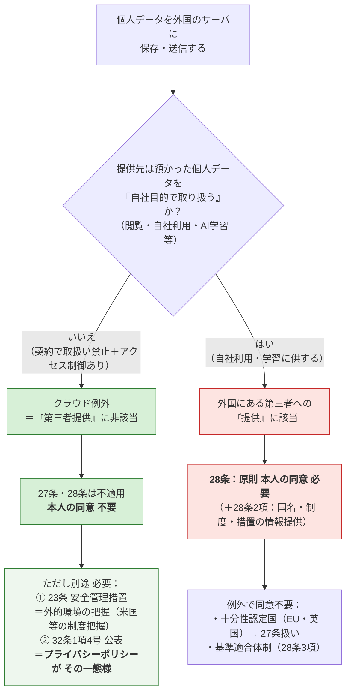

# 個人情報と弊所の体制

> 個人データを海外サーバに保存・送信する場合の判断フロー（個人情報保護法）
> 対象サービス：**Slack** / **Claude（Anthropic）** / **Dropbox**

---

## 判断フロー（1枚図）

---

## 弊所の整理（当てはめ）

> [!info] いずれも「クラウド例外」＝上図の**左ルート**
> Slack・Claude・Dropbox は、契約上いずれも預かったデータを**自社目的で取り扱わない**（Claude は**学習に使わない**）設計。したがって「第三者提供」に非該当＝**クラウド例外**。**本人同意は不要**だが、**23条（外的環境の把握）＋32条（公表）**の対応が必要。

| サービス | 主な用途 | 取扱いの有無 | 法的整理 | 主な保管国 |
|---|---|---|---|---|
| **Slack（Business+）** | 所内コミュニケーション | 自社目的で取り扱わない | クラウド例外 | 主に日本国内（一部・分析用等は米国） |
| **Claude（Team／公式Slackアプリ）** | 業務補助AI | 学習に使わない／自社目的で取り扱わない | クラウド例外 | 米国 |
| **Dropbox** | ファイル保管・共有 | 自社目的で取り扱わない | **クラウド例外（弊所はそう整理する）** | 米国等（プラン・設定により要確認） |

> [!important] Dropbox について
> **弊所は Dropbox もクラウド例外として整理する。** Dropbox は預かったファイルを自社の目的で取り扱わないため、Slack・Claude と同様に「第三者提供」に非該当と考える。

> [!note] 32条の公表について（明記）
> 32条1項4号は「保有個人データの安全管理のために講じた措置」を**本人が知り得る状態に置く**ことを求める。**この公表の一態様が、プライバシーポリシー（個人情報保護方針）への記載**である。弊所は外的環境の把握（米国等）の内容をプライバシーポリシーに記載してこの義務を履行する。

---

## 参照条文

| 条文 | 内容 | 弊所での位置づけ |
|---|---|---|
| **27条** | 第三者提供の制限（国内） | クラウド例外なら非該当 |
| **28条**（旧24条） | 外国にある第三者への提供の制限 | 「取り扱う」場合のみ発動。今回は非該当 |
| **23条** | 安全管理措置（→**外的環境の把握**） | 米国等の制度を把握し措置を実施 |
| **32条1項4号** | 保有個人データに関する公表等 | **プライバシーポリシーで公表**（一態様） |

> 根拠：個人情報保護委員会「個人情報の保護に関する法律についてのガイドライン（通則編／外国にある第三者への提供編）」及び同Q&A（クラウドサービスに関するいわゆる「クラウド例外」）。

---

## 要点（3行まとめ）

1. Slack・Claude・Dropbox は**クラウド例外** → **28条の本人同意は不要**。
2. ただし**23条の外的環境の把握**（保管国＝米国等の把握）と**32条の公表**が必要。
3. **32条の公表の一態様がプライバシーポリシー**。前提（相手が取り扱わない）が崩れると28条の同意問題が復活する。
