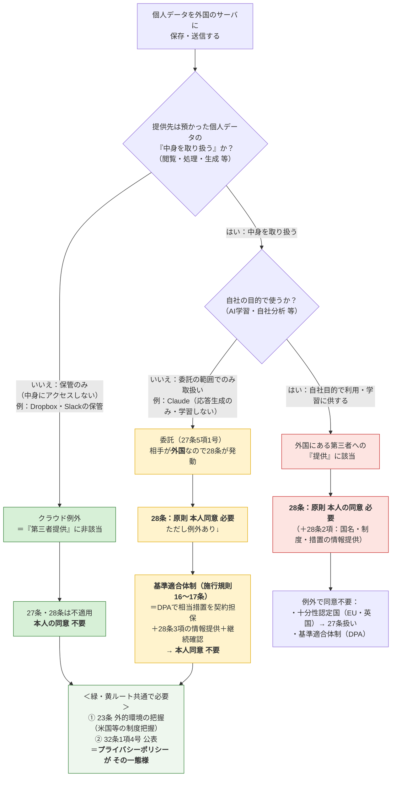

# 個人情報と弊所の体制

> 個人データを海外サーバに保存・送信する場合の判断フロー（個人情報保護法）
> 対象サービス：**Slack** / **Claude（Anthropic）** / **Dropbox**

---

## 判断フロー（1枚図）

> [!tip] 3つの出口の違い
> - **クラウド例外（緑・Dropbox / Slackの保管）**：中身を取り扱わない → 28条そのものが不適用。同意不要。
> - **委託＋基準適合体制（黄・Claude）**：中身は取り扱うが自社目的では使わない → 28条は発動するが、DPAで担保して同意不要。
> - **提供（赤）**：相手が自社目的で使う → 本来の28条。原則同意が必要（個人アカウントの学習オプトイン等でここに落ちる）。

---

## 弊所の整理（当てはめ）

> [!info] 弊所の整理：2ルートに分かれる
> **保管サービス（Slack・Dropbox）＝クラウド例外（緑）**、**AI処理（Claude）＝委託＋基準適合体制（黄）**。いずれも結論は**本人同意 不要**。ただしClaudeは28条が発動するため、**DPAによる基準適合体制＋28条3項の情報提供・継続確認**が追加で必要。共通して**23条（外的環境の把握）＋32条（公表）**の対応が要る。

| サービス | 主な用途 | 取扱い | 法的整理 | 28条 | 本人同意 | 主な保管国 |
|---|---|---|---|---|---|---|
| **Slack（Business+）** | 所内コミュニケーション | 保管のみ（中身にアクセスしない） | クラウド例外 | 不適用 | 不要 | 主に日本国内（一部・分析用等は米国） |
| **Claude（Team／公式Slackアプリ）** | 業務補助AI | 応答生成のため取り扱う（学習しない） | **委託** | **適用** | **不要（基準適合体制で）** | 米国 |
| **Dropbox** | ファイル保管・共有 | 保管のみ | **クラウド例外（弊所はそう整理）** | 不適用 | 不要 | 米国等（プラン・設定により要確認） |

> [!important] Dropbox について
> **弊所は Dropbox もクラウド例外として整理する。** Dropbox は預かったファイルを自社の目的で取り扱わない保管サービスであり、Slack の保管と同様に「第三者提供」に非該当と考える。

> [!warning] Claude について（クラウド例外ではなく委託）
> Claude は入力プロンプトの**中身を読んで応答を生成する**ため、「取り扱わない」を条件とするクラウド例外には馴染まない。**委託**と整理し、相手が外国（米国）にあるため**28条が発動**する。もっとも、**Anthropic の商用規約に組み込まれた標準DPA**（Team契約に自動適用。小規模事務所でも同一内容で利用可）により**基準適合体制**を満たせるので、**個別の本人同意は不要**。
> やること：① 標準DPAの適用を確認・保管、② 本人の求めに応じ移転先措置を説明できる状態、③ サブプロセッサ・規約変更の年1回確認。

> [!note] 32条の公表について（明記）
> 32条1項4号は「保有個人データの安全管理のために講じた措置」を**本人が知り得る状態に置く**ことを求める。**この公表の一態様が、プライバシーポリシー（個人情報保護方針）への記載**である。弊所は外的環境の把握（米国等）の内容をプライバシーポリシーに記載してこの義務を履行する。

---

## 参照条文

| 条文 | 内容 | 弊所での位置づけ |
|---|---|---|
| **27条** | 第三者提供の制限（国内） | クラウド例外なら非該当。委託は5項1号で非該当 |
| **28条**（旧24条） | 外国にある第三者への提供の制限 | Slack/Dropbox（保管）は不適用。**Claude（委託・米国）は適用→基準適合体制で対応** |
| **27条5項1号** | 委託は「第三者」に非該当 | Claudeは委託。ただし国内限定の効果で、外国だと28条が別途かかる |
| **施行規則16〜17条** | 基準適合体制（相当措置の継続的確保） | **DPAで担保**＋28条3項の情報提供＋継続確認 |
| **23条** | 安全管理措置（→**外的環境の把握**） | 米国等の制度を把握し措置を実施（全サービス共通） |
| **32条1項4号** | 保有個人データに関する公表等 | **プライバシーポリシーで公表**（一態様） |

> 根拠：個人情報保護委員会「個人情報の保護に関する法律についてのガイドライン（通則編／外国にある第三者への提供編）」及び同Q&A（クラウドサービスに関するいわゆる「クラウド例外」／委託先が外国にある場合の28条適用／基準適合体制）。生成AIへの入力については同委員会「生成AIサービスの利用に関する注意喚起」も参照。

---

## 要点（3行まとめ）

1. **Slack・Dropbox（保管）はクラウド例外**、**Claude（AI処理）は委託＋基準適合体制** → いずれも**本人同意は不要**。
2. Claudeは28条が発動するが、**Anthropicの標準DPA（小規模でも同一内容で締結可）**で基準適合体制を満たす。共通して**23条（外的環境の把握）＋32条（公表）**が必要。
3. **32条の公表の一態様がプライバシーポリシー**。前提（相手が自社目的で使わない＝学習しない）が崩れると、赤ルート＝28条の本人同意問題が復活する。
